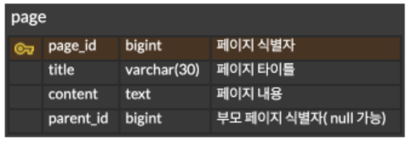

# 페이지 정보 조회 API 추가

## 요구사항

### 과제 요구사항

+ 페이지 정보 조회 API: 특정 페이지의 정보를 조회할 수 있는 API를 구현하세요.
+ 각 페이지는 제목, 컨텐츠, 그리고 서브 페이지를 가질 수 있습니다. 또한, 특정 페이지에 대한 브레드크럼(Breadcrumbs) 정보도 반환해야 합니다.
+ 컨텐츠 내에서 서브페이지 위치 고려 X
+ 입력: 페이지 ID
+ 출력: 페이지 제목, 컨텐츠, 서브 페이지 리스트, **브로드 크럼스 ( 페이지 1 > 페이지 3 > 페이지 5)**

```json
{
  "pageId": 1,
  "title": 1,
  "subPages": [],
  "breadcrumbs": [
    "A",
    "B",
    "C"
  ]
  // 혹은 "breadcrumbs" : "A / B / C"
}
``` 

### **팀에서 추가한 요구사항**

+ 페이지는 여러 개의 서브페이지를 가질 수 있다. 서브페이지들 사이에는 순서가 존재하지 않는다.
+ 각 페이지는 **하나의 부모**만을 가질 수 있다. 즉, 페이지의 브레드크럼은 하나이다. 노션에서도 이미 다른 페이지의 서브페이지인 페이지를 서브페이지로 추가하는 경우 복제된 페이지가 생성된다.
+ 브레드크럼은 조회대상 페이지도 포함한다.
+ 유저에 대한 부분은 생략한다. 페이지에 작성자에 대한 정보를 저장하지 않는다.
+ 없는 페이지 조회시 Null을 반환한다.
+ 페이지 계층 사이에 cycle구조가 생기는 경우는 없다. A -> B -> C -> A 처럼 자식이 다시 부모 페이지를 서브페이지로 등록하는 경우는 없다.
+ 결과 정보

```json
{
  "pageId": 1,
  "title": "title1",
  "content": "content1",
  "subpages": [
    {
      "id": 8,
      "title": "title8"
    },
    {
      "id": 9,
      "title": "title9"
    }
  ],
  "breadcrumbs": [
    {
      "id": 10,
      "title": "title10"
    },
    {
      "id": 11,
      "title": "title11"
    },
    {
      "id": 11,
      "title": "title11"
    }
  ]
}
```

## 테이블 정보



### parent_id를 별도의 테이블에서 관리하지 않는 이유


다음과 같이 페이지 테이블과, 페이지 관계 나타내는 page_parent 테이블로 분리하는 방법도 있다. 서브페이지로 추가하면 관계가 생성되는 것으로 page_parent에 row가 추가된다. 이 경우 다음과 같은
문제가 있다.

1. 부모 페이지는 하나밖에 될수 없는데 별도의 테이블에 저장하기 위해 기본키, 외래키등 부가적인 키가 필요해 저장공간이 낭비된다.
2. 페이지의 부모페이지 id를 찾기 위해서 join을 수행해야한다. 반면에 page 테이블에서 parent_id를 필드로 가지는 경우 별도의 join 없이 빠르게 부모 페이지 id를 찾을 수 있다.

## 프로젝트 구조

```json
.
├── build.gradle
└── src
├── main
│   ├── java
│   │   └── com
│   │       └── wanted
│   │           └── notion
│   │               ├── NotionApplication.java
│   │               ├── domain
│   │               │   └── page
│   │               │       └── PageDao.java 페이지 관련 데이터베이스 접근 객체
│   │               ├── dto
│   │               │   ├── BreadcrumbDto.java PageDto 포함되는 breadcrumbs와 subpages의 정보를 담기 위한 객체
│   │               │   └── PageDto.java 페이지 정보, 서브페이지 리스트, 브레드크럼을 모두 저장하는 객체
│   │               └── service
│   │                   └── PageService.java PageDao 페이지 관련 서비스 객체
│   └── resources
│       ├── application.yml 어플리케이션 설정파일. 데이터소스 관련 설정 포함
│       ├── data.sql  schema.sql 에 의해 테이블 생성 후 초기 데이터 추가 DML 파일
│       ├── schema.sql 어플리케이션 구동시 테이블 생성하기 위해 사용되는 DDL 파일
│       ├── static
│       └── templates
└── test
  └── java
    └── com
      └── wanted
        └── notion
          └── service
            └── PageServiceTest.java
```

## 구현 방법

### 브레드크럼 조회 방법

+ 페이지의 브레드크럼을 조회하기 위해서 두가지 방식을 사용할 수 있다.

1. 어플리케이션에서 부모를 조회하는 **쿼리를 여러번** 실행한다. : id = parent_id인 행을 조회한 후 반환된 결과의 parent_id로 다시 id =parent_id인 행을 조회한다.
   parent_id = null일때까지 반복해서 수행한다.
2. 어플리케이션에서는 **한번의 쿼리**를 수행한다. 데이터베이스에서 recursive하게 데이터를 조회한 후 그 결과를 반환한다.

+ 두가지 방식 중 **1. 어플리케이션에서 여러번 쿼리를 실행**하는 방법을 선택했다.
    + **여러번** 데이터베이스에 요청하는 것은 **성능이 저하**될 수 있다.
    + 하지만, 한번의 쿼리만으로 브레드크럼 전체를 조회하기 위해서는 **쿼리가 복잡**해지는데 그 경우 유지보수하기 어려워질 수 있다. 특히, 더 많은 테이블이 추가되는 경우 쿼리를 **수정하기가 어려**
      워진다.
    + 한 행씩 조회하는 경우 그 결과를 **캐싱**해둔다면 DB에 요청하는 횟수를 줄일 수 있다.

### LinkedList 사용

브레드크럼은 상위 부모일수록 리스트의 앞쪽에 저장되어야 한다. DB에서 조회할때는 **하위 부모부터 검색**하게 되므로 리스트의 앞쪽에 저장하기 위해서는 이미 조회된 데이터를 뒤로 밀어야한다. 따라서, 성능을 위해
LinkedList를 사용하여 저장하였다. 리스트의 처음에 추가하기 위해서 링크만 조정해주면 되기 때문에 ArrayList를 사용할때보다 더 효율적이다.

### 캐싱

+ DB에서 한 행씩 조회한 결과를 {페이지 id: 페이지 객체}로 어플리케이션 내부 메모리에 캐싱해둔다.
+ 이후 같은 페이지 조회 요청이 들어오면 캐시를 반환하므로 DB 요청이 발생하지 않고 빠르게 조회할 수 있다.
+ 현재 과제는 조회 API를 구현하는 것으로 **캐시 무효화**로직은 구현하지 않았다. 캐시 무효화의 경우 **데이터의 수정, 삭제**시에 같이 캐시를 무효화해주어 캐시 데이터와 원본 데이터를 동기화 할 수 있도록
  한다.

### 3번 시도

+ 데이터베이스에서 데이터를 조회하다 예외가 발생하는 경우 최대 3번까지 다시 시도하도록 한다.
+ 브레드크럼 전체를 조회하기 위해서 여러번 쿼리가 실행되는데 그 중 한번의 쿼리가 실패한다고 전체 조회가 실패되지 않도록 한다.

## 테스트

+ data.sql에 의해서 추가된 데이터를 대상으로 테스트를 진행한다.
+ 테스트 내용
    1. breadcrumbs가 현재 페이지를 포함하는지
    2. breadcrumbs의 순서가 올바른지(현재 페이지가 가장 마지막)
    3. 데이터가 누락되지 않는지
    4. 존재하지 않는 페이지 조회시 예외를 발생하는 것이 아닌 null 반환하는지